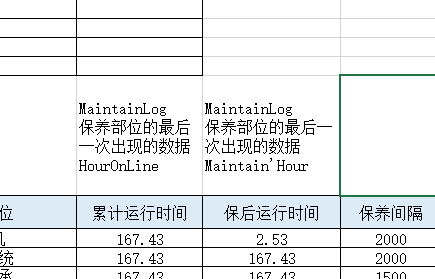

Library_BillOfMaterials							物料信息

Library_BinFormulaItems						 临时配方

Library_BinFormulas								 计划与配方对应关系

Library_BomFormulaItems  					  基础配方

Produce_Missions									   每一车的总信息

Produce_ProducePlans								生产计划信息

Recorder_MissionStatementItems			   每盘的详细消耗

Recorder_MissionStatements					   每一盘的生产信息

Virtual_MaterialBins									 


上报-定时查询-定时任务

定时任务的查询

搅拌站墨筑通模块路径    api/custom/mixing

sqlserver 开sa账号 开tcp/ip访问 查看tcp/ip详情tcp动态端口为数据库端口

客户系统-查询的上报

墨筑通-接收存储


**SQL脚本的导入**		***<u>替换掉</u>***


BinCode 仓编号

BomCode 物料编号

LineCode 生产编号

StandCode 规格编号

```python
 注浆 m30 混凝土 ，砂浆 c30 混凝土的强度更高。M为B,C砂浆为A


水胶比 = 清水 / （水泥+粉煤灰）

水胶比 = 150 / (250+50)
```


**仓库管理**

```python
LibraryBillOfMaterial.Code => Virtual_MaterialBins.BomCode 
```


**物料配方管理**

> ```python
> Library_BinFormulas
> Library_BomFormulas
> Library_BomFormulaItems
> ```


**智能保养**




**智能维保**


```python
#生产计划
{
  "plan_dict": {
    "plan1": {"code": "Plan_000102", "customer_name": "\u4e2d\u94c1\u5927\u6865\u5c40\u6843\u6e90\u5927\u6865", "project_name": "\u4e2d\u94c1\u5927\u6865\u5c40\u6843\u6e90\u5927\u6865\u9879\u76ee\u90e8", "quantity": 2.0, "distance": 0.0, "date_region_start": "2022-11-15 08:58:34", "date_region_final": "2022-11-23 08:58:34", "project_address": "", "remark": "", "concrete_sign": "A \u7802\u6d46-1\u00b110", "date_region": "2022-11-15-2022-11-23"},

    "plan2": {"code": "Plan_000101", "customer_name": "\u4e2d\u94c1\u5927\u6865\u5c40\u6843\u6e90\u5927\u6865", "project_name": "\u4e2d\u94c1\u5927\u6865\u5c40\u6843\u6e90\u5927\u6865\u9879\u76ee\u90e8", "quantity": 2.0, "distance": 0.0, "date_region_start": "2022-11-15 07:13:12", "date_region_final": "2022-11-16 07:13:12", "project_address": "", "remark": "", "concrete_sign": "A \u7802\u6d46-1\u00b110", "date_region": "2022-11-15-2022-11-16"}

  }
}

解决json.dumps中文乱码
json.dumps(data, ensure_asscii=False)
```


**单次上报不超过100包括100**
**每次上报完的数据入库  sqlite存储**


mysql   ： sqlite

```python
"""
sqlserver_data = 客户数据
sqlite_data = sqlite数据
count = 0
for i in sqlserver_data:
    upload_data = [] #上报数据
    if i.id not in sqlite_data: #判断客户数据的id 是否在 sqlite
        sqlite_data.add(i)
        upload_data.append(i)
        count += 1
    if count == 100: #当数据达到100条时
        print("上报数据")
        count = 0
"""       
        
"""
[{d1},{d2}]
# 先分组
[[{d1}],[{d2}]]

list = []
batch_search()批量查询
group_list = [list[i:i+5] for i in range(0,len(list),5)]
for gl in group_list:
    no = [i["datano"] for i in gl]  [1,2,3,4,5]
    batch_nos = batch_search(no)  [1,2,3,4,5]
    if len(batch_nos)  != len(no):
       diff = list(set(no).difference(set(batch_nos)))
       g = [{},{}]
       diff_group = [g for g in gl if g["datano"] in diff]
       上报数据
       if 上报成功:
        batch_history()存sqlite数据库备份
"""
```


```python
Cache_DispatchBillPrints			存储发货清单
Cache_ParameterItems				存储参数项
Cache_RunningCodes					存储运输编号
Cache_ScaleDischargeFlux			
Cache_TotalConsumes					存储消耗总数
Cache_TotalPlans					存储计划总数
Cache_TotalYields					存储生产总数
Cached_Propertys					存储使用权
Carriage_Deliverys					运输交货
Carriage_TransportDrivers			运输车辆信息
Carriage_Transports					运输车辆
Global_BusinessRegulations			业务管理
Library_BillOfMaterials				材料清单库
Library_BinFormulaItems				临时配方库
Library_BinFormulas					生产计划对应配方库
Library_BomFormulaItems				物料配方库
Library_BomFormulas					物料库
Library_ConcreteStandards			混凝土标准库(空)
Library_PlanFormulaBindings			计划配方绑定库
MaintainInfo						保养信息
MaintainLog							保养日志
Market_ConcreteOrderItems			市场混凝土临时订购
Market_ConcreteOrders				市场混凝土订购
Market_Customers					市场客户
ObjeceDataChangeNum					目标数据更换数字
ObjectStatus						目标状态
OperationSecond						操作调度
PrintRecord							记载记录
Produce_MissionFormulaItems			临时生产任务
Produce_Missions					生产任务
Produce_ProducePlans				生产计划
Recorder_MannualConsume				记录手动消耗
Recorder_MissionStatementItems		每盘的详细消耗
Recorder_MissionStatements			每一盘的生产信息
RunningCode_BindingTransportDriver	
RunningCode_Deliverys				
RunningCode_Missions
RunningCode_OrderItems
RunningCode_PlanFormulaBindings
RunningCode_Standards
Security_AccessRules				安全访问规则
Security_LoginRecorders				安全登录记录员
Security_Roles						安全角色
Security_Users						安全用户
Security_UsersInRole				安全用户对应角色
Storage_PutInRecorders				
UserManipulation
Virtual_BinBindingRecorders			实际
Virtual_BinToScales					实际仓库规模
Virtual_BomToBins					实际物料对仓库编号
Virtual_MaterialBins				实际含水率
Virtual_MaterialScales				
Virtual_Workstations
```

