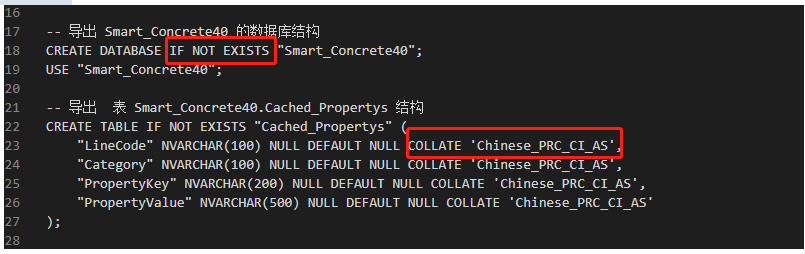
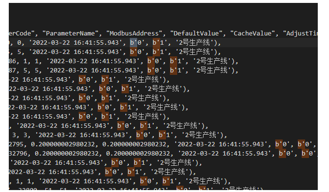
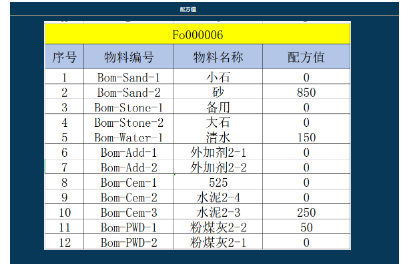
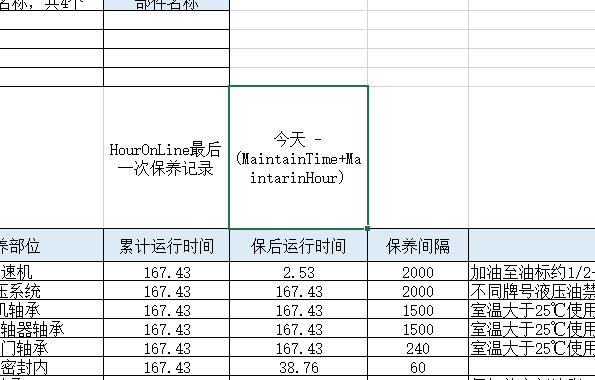
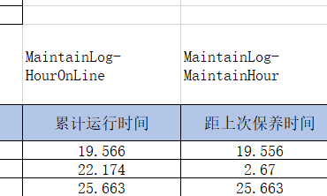
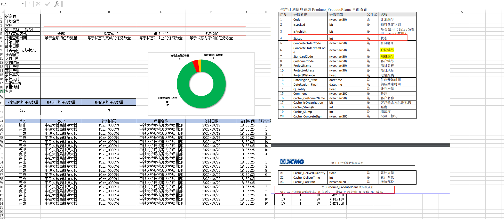

Library_BillOfMaterials							物料信息

Library_BinFormulaItems						 临时配方

Library_BinFormulas								 计划与配方对应关系

Library_BomFormulaItems  					  基础配方

Produce_Missions									   每一车的总信息

Produce_ProducePlans								生产计划信息

Recorder_MissionStatementItems			   每盘的详细消耗

Recorder_MissionStatements					   每一盘的生产信息

Virtual_MaterialBins									 


上报-定时查询-定时任务

定时任务的查询

搅拌站墨筑通模块路径    api/custom/mixing

sqlserver 开sa账号 开tcp/ip访问 查看tcp/ip详情tcp动态端口为数据库端口

客户系统-查询的上报

墨筑通-接收存储


**SQL脚本的导入**		***<u>替换掉</u>***






BinCode 仓编号

BomCode 物料编号

LineCode 生产编号

StandCode 规格编号

```python
 注浆 m30 混凝土 ，砂浆 c30 混凝土的强度更高。M为B,C砂浆为A


水胶比 = 清水 / （水泥+粉煤灰）

水胶比 = 150 / (250+50)
```



**仓库管理**

```python
LibraryBillOfMaterial.Code => Virtual_MaterialBins.BomCode 
```


**物料配方管理**

> ```python
> Library_BinFormulas
> Library_BomFormulas
> Library_BomFormulaItems
> ```


**智能保养**




**智能维保**




```python
#生产计划

{
  "plan_dict": {
    "plan1": {"code": "Plan_000102", "customer_name": "\u4e2d\u94c1\u5927\u6865\u5c40\u6843\u6e90\u5927\u6865", "project_name": "\u4e2d\u94c1\u5927\u6865\u5c40\u6843\u6e90\u5927\u6865\u9879\u76ee\u90e8", "quantity": 2.0, "distance": 0.0, "date_region_start": "2022-11-15 08:58:34", "date_region_final": "2022-11-23 08:58:34", "project_address": "", "remark": "", "concrete_sign": "A \u7802\u6d46-1\u00b110", "date_region": "2022-11-15-2022-11-23"},

    "plan2": {"code": "Plan_000101", "customer_name": "\u4e2d\u94c1\u5927\u6865\u5c40\u6843\u6e90\u5927\u6865", "project_name": "\u4e2d\u94c1\u5927\u6865\u5c40\u6843\u6e90\u5927\u6865\u9879\u76ee\u90e8", "quantity": 2.0, "distance": 0.0, "date_region_start": "2022-11-15 07:13:12", "date_region_final": "2022-11-16 07:13:12", "project_address": "", "remark": "", "concrete_sign": "A \u7802\u6d46-1\u00b110", "date_region": "2022-11-15-2022-11-16"}

  }
}
```



