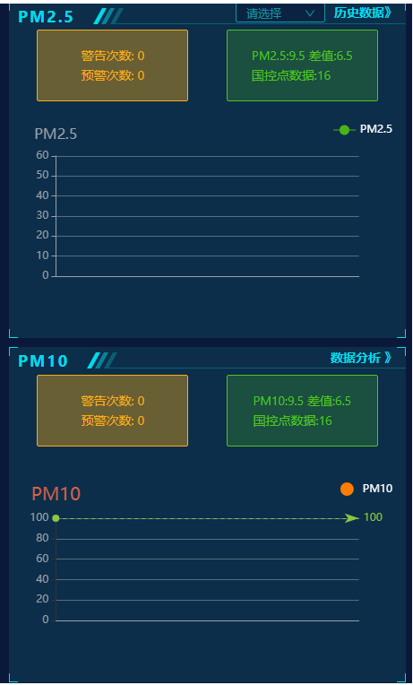
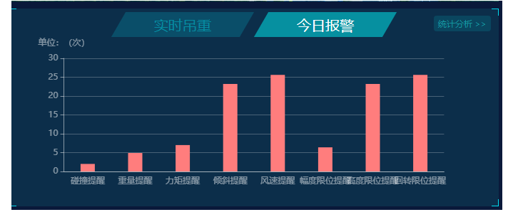
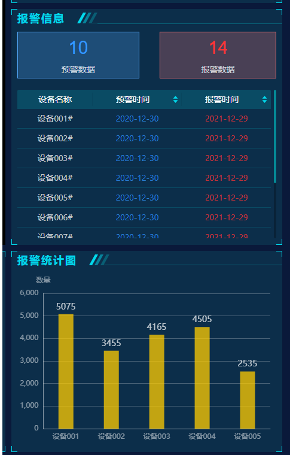
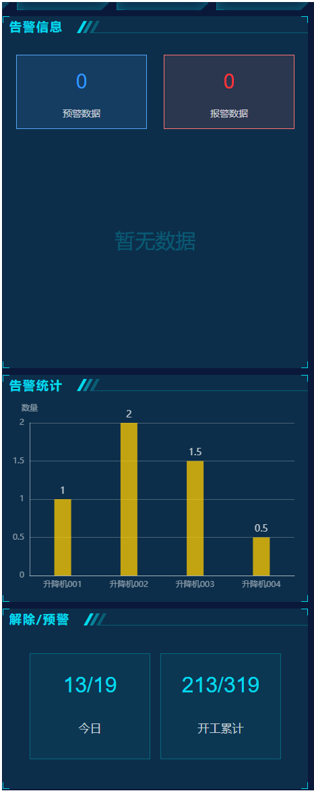
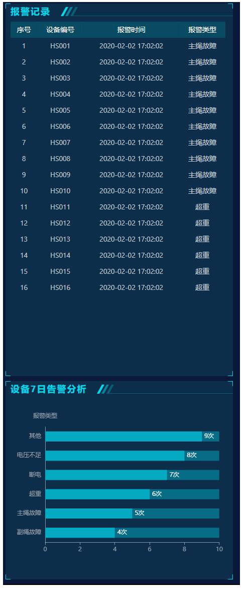
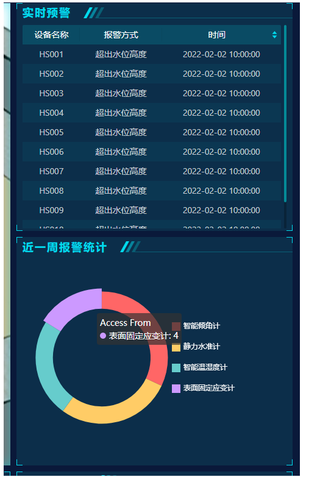
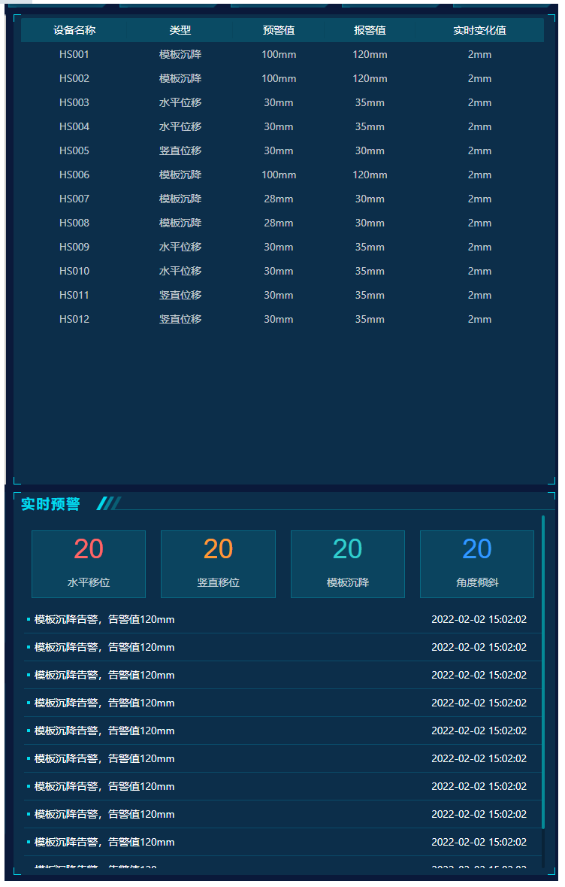
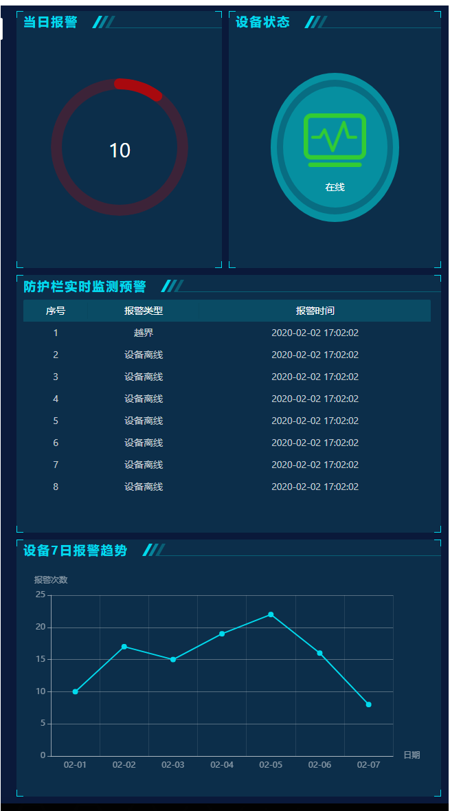

## 设备预报警规则设计

预警规则包含设备：

扬尘器、塔吊、卸料平台、升降机、高支模、深基坑、电表、水表

报警规则包含设备：

扬尘器、塔吊、卸料平台、升降机、高支模、深基坑、电表、水表、临边防护

**扬尘器	tb_dust_rel			 	 塔吊			tb_tower_rel**

**升降机	tb_elevator_rel			卸料平台	tb_unload_rel**

**高支模	tb_high_mold_rel		深基坑	    tb_deep_pit_rel**

**电水表    tb_hydropower_rel 		临边防护	tb_border_rel**

**临边防护	tb_dust_aux_rel**


批量新增规则

```python
{
  "assoc_dev": 1,
  "dev_name_type": 3,
  "module": 1,
  "pid": 1,
  "rule_dict": {    
          "rule1": {"text_desc":"测试1","dev_field_type":6,"symbol":2,"value_num":30},
          "rule2": {"text_desc":"测试2","dev_field_type":5,"symbol":3,"value_num":40},
          "rule3": {"text_desc":"测试3","dev_field_type":4,"symbol":1,"value_num":20},
          "rule4": {"text_desc":"测试4","dev_field_type":1,"symbol":4,"value_num":10}
   }
}

{
  "assoc_dev": 2,
  "dev_name_type": 3,
  "ids": [
   114,115,136
  ],
  "dev_id":["UN1001"],
  "module": 1,
  "pid": 1,
  "rule_dict": {    
          "rule1": {"text_desc":"倾斜度过大","dev_field_type":3,"symbol":1,"value_num":30},
          "rule2": {"text_desc":"高度过高","dev_field_type":2,"symbol":3,"value_num":40},
          "rule3": {"text_desc":"重量过重","dev_field_type":1,"symbol":1,"value_num":20}
   }
}
```


设备的预警和报警数据

**扬尘器**





**塔吊**



**升降机**



**卸料平台**



**深基坑**



**高支模**



**临边防护**




数字工地

```
动态查看点位信息
point_info
{"塔吊":{"塔吊1":"最下面"},"卸料平台":{"卸料平台1":"上面"}}
{"1":{"aaa":"bbb"},"2":{"ccc":"ddd"}}
```

